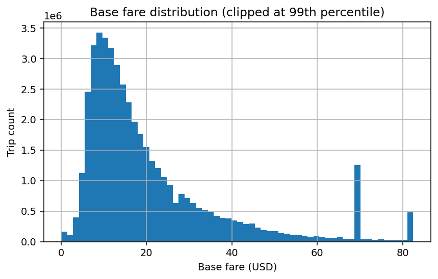
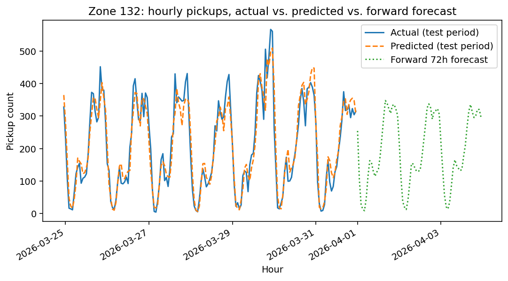
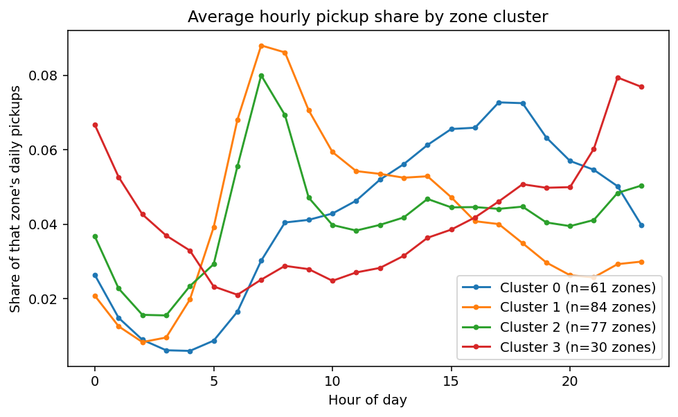

# Urban Flow Analytics — Technical Report
### Dataverse — SLIIT Codefest Datathon 2026

---

## 1. Introduction

Urban transportation networks generate millions of trip records, but raw operational data is rarely
analysis-ready. This report documents our data-quality assessment, leakage-safe predictive modeling, demand
forecasting, and spatial analysis of the Urban Flow Analytics Taxi Dataset (~48.6 million trips, April 2025
– March 2026) and Zone Dataset (265 zones), addressing Parts 1–4 of the challenge.

## 2. Dataset Overview

| | |
|---|---|
| Taxi records | 48,601,782 rows across 12 monthly files |
| Zone reference | 265 zones (`loc_id`, `borough_name`, `zone_name`, `service_zone`) |
| Key columns | `pickup_timestamp`, `dropoff_timestamp`, `distance_miles`, `rider_count`, `base_fare`, `origin_loc_id`, `dest_loc_id`, plus a post-trip fee breakdown (`toll_total`, `driver_tip_payment`, `charge_total`, etc.) |

Column names and types were discovered by chunked profiling (never loading a full ~450MB monthly file at
once) before any modeling code was written, confirming the schema rather than assuming it.

## 3. Data Quality & Cleaning (Part 1)

Every anomaly type required by the challenge was detected, quantified, and given a documented, deterministic
treatment — no row was silently removed.

| Anomaly | Affected (avg/month) | Total rows | Treatment | Justification |
|---|---|---|---|---|
| Negative fare | 4.83% (range 0.52–9.45%) | 2,400,031 | Drop | Investigated directly: occurs **exclusively** under `provider_code==2`, and correlates strongly with `fare_settlement_method` (code 4 → 46.9% negative, code 1 → ~0%). Systematic, consistent with voided/refunded/disputed trips for one provider — not random data corruption. |
| Zero distance, nonzero fare | 2.63% | 1,267,110 | Keep + flag | Plausible for short/cancelled-but-charged trips; flagged for downstream review rather than assumed invalid. |
| Nonpositive duration | 1.33% | 651,610 | Drop | Zero/negative duration cannot represent a real trip. |
| Zero passengers | 0.47% | 231,578 | Keep + flag | May reflect a sensor/logging default rather than an empty cab. |
| Unrealistic speed | 0.024% | 11,899 | Drop | Threshold (100 mph) set from a real percentile check on April 2025: the distribution breaks ~50x between the 99.9th percentile (46.2 mph) and 99.99th (2,479 mph). |
| Drop-off before pickup | 0.004% | 1,942 | Drop | Logically impossible timestamp ordering. |

**Missing values:** `rider_count`, `rate_class_id`, and `offline_record_flag` are missing *together* on
~19–26% of rows/month — the same rows, not independently — consistent with one record source never
populating those fields. This is treated as structural, not random (see §5).

**Net retention: 45,538,913 of 48,601,782 rows (93.7%)** after deterministic cleaning, across all 12 months.

## 4. Train / Validation / Test Strategy & Leakage Prevention

The split is **chronological by month**, not random, because the data is temporal and the challenge cares
about generalizing forward in time:

| Split | Months | Approx. rows |
|---|---|---|
| Train | 2025-04 – 2025-12 (9 months) | 34.7M |
| Validation | 2026-01, 2026-02 (2 months) | 7.0M |
| Test | 2026-03 (1 month) | 3.9M |

Test data was touched exactly once, for final evaluation, after model selection was locked in on
validation. Before any model was trained, every candidate feature was run through a formal leakage audit
(available at prediction time? derived from the target? calculated from future/validation/test data?). The
one initially ambiguous feature, `fare_settlement_method`, was resolved to **exclude** using the negative-fare
correlation evidence from §3 — a post-trip settlement code, not something known at booking. All fee/charge
columns (`charge_total`, `driver_tip_payment`, etc.) are excluded outright: `charge_total` is a direct
function of `base_fare`, so including it would be immediate target leakage.

## 5. Data Preprocessing & Feature Engineering

*(kept to one page per the challenge's requirement)*

**Deterministic features** (computed before the split, using only per-row information): `pickup_hour`,
`pickup_dow`, `pickup_month`, `is_weekend`, `pickup_zone`/`dropoff_zone` (from `origin_loc_id`/`dest_loc_id`).

**Learned preprocessing** (fit on the training split only):

```
SimpleImputer(strategy="median", add_indicator=True)              → numeric columns
SimpleImputer(strategy="most_frequent")                            → categorical columns
OneHotEncoder(handle_unknown="ignore", max_categories=40, sparse_output=False)
StandardScaler()
```

Two choices are non-default and deliberate:

- **`add_indicator=True`**: `rider_count`'s missingness (§3) is structural, not random — a missing-value
  indicator column preserves that signal instead of hiding it behind a median fill.
- **`max_categories=40`**: `pickup_zone`/`dropoff_zone` each have up to ~260 categories; uncapped one-hot
  encoding produces ~520 columns, which is slow for tree models and forces a choice between sparse output
  (incompatible with `HistGradientBoostingRegressor`) and a ~16GB dense matrix at full training-set scale.
  Capping to the 40 most frequent zones (others grouped into an "infrequent" bucket) keeps the encoding to
  ~80 columns.

All statistics (medians, most-frequent categories, one-hot vocabulary, scaling parameters) are fit via
`pipeline.fit(X_train, y_train)` only; validation and test data only ever pass through `.transform()`.

## 6. Model Development Methodology

For both fare and trip-duration prediction, four candidates were trained and compared on validation: a mean
baseline, Ridge regression, Random Forest, and HistGradientBoostingRegressor. The strongest candidate per
task was then tuned with a focused `RandomizedSearchCV` (6 iterations, 3-fold CV, tuning `max_depth` and
`learning_rate` only — not an exhaustive grid), before a single final evaluation on the held-out test set.

For demand forecasting, hourly pickup counts were built for the 10 busiest zones, with lag (`T-1, T-2, T-3,
T-24, T-48, T-168`) and rolling-mean (24h, 168h) features computed **strictly from the past** — every
rolling window uses `shift(1)` before `rolling(...)`, so no window ever includes the hour it predicts. A
single `HistGradientBoostingRegressor` was trained and evaluated on a chronological backtest, then refit on
all available history to generate genuine forward 24/48/72-hour forecasts via recursive prediction (each
step's output feeds the next step's lag features).

Given the training split's true size (~34.7M rows), model fitting uses a fixed, reproducible 4-million-row
sample (`random_state=42`) drawn only from the training split — a documented, leakage-safe compute-budget
decision, not an oversight.

## 7. Evaluation Metrics — Rationale

**MAE** gives an average error in the target's own units (dollars, minutes, pickups/hour) that a business
reader can act on directly. **RMSE** penalizes large individual misses more heavily than MAE, which matters
for a pricing/ETA product where one badly-wrong quote damages trust more than several small ones. **R²**
expresses how much of the target's variance the model explains relative to a naive baseline, useful for
quickly comparing candidates during experimentation. All three are standard for continuous regression
targets and together give a complete picture: typical error size, sensitivity to outliers, and relative
explanatory power.

## 8. Results

### 8.1 Fare Prediction (`base_fare`)

| Model | Split | MAE | RMSE | R² |
|---|---|---|---|---|
| Baseline (mean) | validation | 12.03 | 18.02 | -0.003 |
| Ridge | validation | 5.44 | 10.99 | 0.627 |
| Random Forest | validation | 4.65 | 9.60 | 0.715 |
| HistGradientBoosting | validation | 4.62 | 10.01 | 0.691 |
| **HistGradientBoosting (final)** | **test** | **4.49** | **10.01** | **0.701** |

### 8.2 Trip Duration Prediction

| Model | Split | MAE | RMSE | R² |
|---|---|---|---|---|
| Baseline (mean) | validation | 10.13 | 25.25 | -0.0003 |
| Ridge | validation | 6.09 | 23.00 | 0.170 |
| Random Forest | validation | 5.06 | 22.74 | 0.189 |
| HistGradientBoosting | validation | 4.74 | 22.28 | 0.221 |
| **HistGradientBoosting (final)** | **test** | **4.36** | **21.54** | **0.257** |

Duration's materially lower R² is an expected, documented limitation, not a modeling failure: real-time
traffic conditions — the dominant driver of trip time variance — are not present in this dataset.

### 8.3 Demand Forecasting

| Split | MAE | RMSE |
|---|---|---|
| Validation | 25.25 | 38.60 |
| **Test (final)** | **21.61** | **32.51** |

Against a mean of ~160 pickups/hour across the top 10 zones, test MAE represents roughly 13.5% relative
error.


*Figure 1: Base fare distribution. Two spikes (~\$70, ~\$82) reveal flat-rate airport fares hiding inside
what otherwise looks like a smooth continuous distribution.*


*Figure 2: One zone's test-period actual-vs-predicted fit alongside its forward 72-hour recursive forecast,
correctly continuing the observed daily cycle.*

## 9. Spatial / Origin-Destination Analysis

The busiest pickup zones are dominated by Manhattan (Upper East Side, Midtown, Times Square) plus both
airports (JFK, LaGuardia) — consistent with the flat-fare spikes in Figure 1. The single busiest
origin-destination corridor is Upper East Side South ↔ Upper East Side North, indicating that high trip
volume is driven substantially by short local hops rather than long cross-borough journeys.

Zones were clustered (KMeans, k=4) by their *normalized* 24-hour pickup-share shape — independent of raw
volume — so zones with similar temporal behavior group together regardless of size:


*Figure 3: Four distinct demand archetypes across 252 zones with sufficient data. Cluster 0 (61 zones):
afternoon/evening-peaked. Clusters 1 & 3 (84 + 30 zones): sharp early-morning peak, consistent with airport
departures. Cluster 2 (77 zones): flatter, moderate pattern.*

## 10. Key Findings & Business Implications

1. **Fare is substantially more predictable than duration from pre-trip information alone** (R² 0.70 vs.
   0.26). Upfront pricing is a viable product feature today; upfront ETA promises are not, without adding
   real-time traffic data.
2. **"Negative fare" is a specific, identifiable pattern, not noise** — traced to one provider and specific
   settlement codes. Worth a direct operational conversation with that provider, not just statistical
   exclusion.
3. **Flat-rate airport pricing is visible directly in the fare distribution**, suggesting the upfront-pricing
   engine should special-case these known routes rather than rely purely on a general regression.
4. **Demand has four distinct temporal archetypes across zones**, independent of raw volume — fleet
   pre-positioning should follow cluster-specific timing, not a single citywide schedule.
5. **Missingness in `rider_count`/`rate_class_id`/`offline_record_flag` is structural**, pointing at a
   specific data source/provider gap rather than random sensor noise.

## 11. Limitations

- No live traffic, weather, or event data — the primary constraint on duration-prediction accuracy.
- Model fitting uses a reproducible 4M-row sample of the 34.7M-row training split, a documented
  compute-budget trade-off on standard hardware.
- Zone one-hot encoding is capped at the 40 most frequent categories per column; rarer zones share an
  "infrequent" bucket.
- Demand forecasting pools all 10 top zones into one model without an explicit zone-identity feature,
  relying on each zone's own lag/rolling history instead.
- `distance_miles` is treated as available pre-trip for the fare model as a stated assumption, not a
  data-dictionary certainty.

## 12. Solution Architecture

```
RAW MONTHLY CSVs (12 files, ~48.6M rows)  +  Zone Reference (265 zones)
                    |
                    v
        SCHEMA / DATASET PROFILING  (chunked, never full-file-in-memory)
                    |
                    v
     DETERMINISTIC DATA-QUALITY CLEANING  (5 anomaly types, documented rules)
                    |
                    v
           PROCESSED PARQUET  (45.5M rows, 93.7% retention)
                    |
        +-----------+-----------+
        |                       |
        v                       v
  EXPLORATORY ANALYSIS    TARGET DEFINITION
                                |
                                v
                         LEAKAGE AUDIT
                                |
                                v
                TRAIN (9mo) / VALIDATION (2mo) / TEST (1mo)
                                |
                                v
                TRAIN-FITTED PREPROCESSING
                (median+indicator impute, capped one-hot, scale)
                                |
            +-------------------+-------------------+
            |                   |                   |
            v                   v                   v
      FARE MODEL          DURATION MODEL       DEMAND MODEL
    (HistGBM, R²=0.70)   (HistGBM, R²=0.26)   (HistGBM, lag/rolling,
                                                24/48/72h forecast)
            |                   |                   |
            +-------------------+-------------------+
                                |
                                v
                    SPATIAL / OD ANALYTICS
                 (hotspots, OD flows, zone clustering)
                                |
                                v
                       BUSINESS INSIGHTS
                                |
                                v
                    MANAGEMENT DECISION SUPPORT
```

## 13. Conclusion

This pipeline demonstrates the complete required path: raw data → schema discovery → documented
data-quality cleaning → clean data → EDA → target definition → leakage audit → train/validation/test split
→ training-only preprocessing → features → prediction → forecasting → spatial analytics → business
insights, with leakage avoidance demonstrated by evidence — audit tables, split definitions, and the
sampling/encoding decisions above — rather than asserted in prose. All source code is in `src/`, independently
reusable via `python -m src.<module>`, and the accompanying `Dataverse_FinalNotebook.ipynb` assembles these
results into the full narrative.
